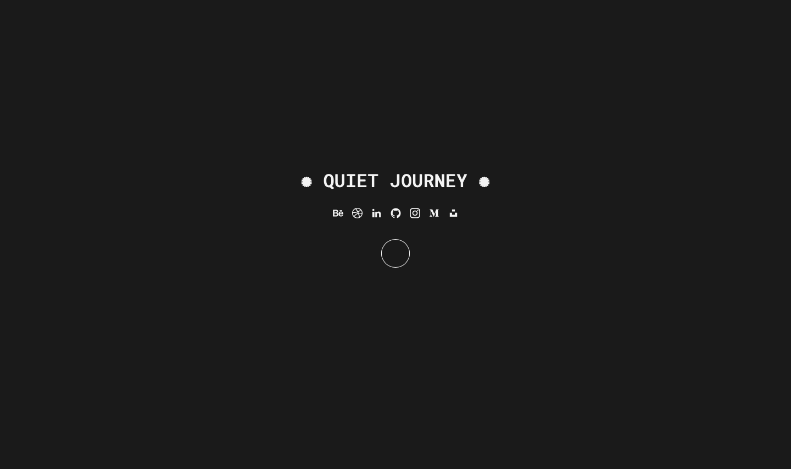

  

<h3>✺ Quiet Journey ✺</h3>

The Quiet Journey is a meditation website designed to provide a serene and peaceful experience for users seeking relaxation and mindfulness.

<h4>✹ Goal ✹</h4>

The main objective of the Quiet Journey website is to offer a virtual space for users to engage in guided meditation sessions. The goal is to create a calming environment that helps individuals reduce stress, increase self-awareness, and promote mental well-being.

<h4>✹ Design ✹</h4>

The Quiet Journey website features a minimalist design with a focus on simplicity and tranquility. The interface utilizes soft colors, clean typography, and ample white space to create a visually soothing experience. The central element is a circle, representing a symbol of mindfulness and unity.

<h4>✹ Features ✹</h4>

* <b>Guided Meditation:</b> Users can click on the circle to start a guided meditation session. The website provides a curated script that guides users through a peaceful journey of self-reflection and relaxation.
* <b>Text Animation:</b> As the guided meditation progresses, the text lines appear one by one, creating a sense of flow and progression. Each new line replaces the previous one, allowing users to focus on the current instruction.
* <b>Minimalistic Interface:</b> The website follows a minimalistic approach, providing a distraction-free environment for meditation. By keeping the interface simple and uncluttered, users can immerse themselves in the practice without unnecessary distractions but you have to keep your eyes open.
* <b>Responsive Design:</b> The website is designed to be responsive, ensuring a seamless user experience across different devices and screen sizes.

<h4>✹ What I've Learned ✹</h4>

* <b>DOM Manipulation:</b> Developing the Quiet Journey website helped me strengthen my skills in manipulating the Document Object Model (DOM) using JavaScript. I learned how to dynamically create and update elements to create interactive and engaging experiences.
* <b>Event Handling:</b> Through the project, I gained experience in handling user interactions and responding to events such as clicks, allowing for a smooth meditation experience.
* <b>Visual Design:</b> The Quiet Journey website allowed me to explore the principles of minimalistic design and create a visually calming and cohesive interface.
* <b>Creating Tranquil Experiences:</b> By developing the website, I learned how to use various design elements and techniques to create a serene and relaxing digital environment.

<h4>✹ Link to the Project ✹</h4>

<h5>https://bypedroneres.github.io/Quiet-Journey/</h5>

<h4>✹ Thanks for your interest! ✹</h4>

Feel free to visit the Quiet Journey website and embark on a tranquil meditation journey. Take a moment to unwind, find inner peace, and cultivate mindfulness. If you have any feedback or suggestions, please don't hesitate to reach out. Wishing you a peaceful and fulfilling meditation experience!
